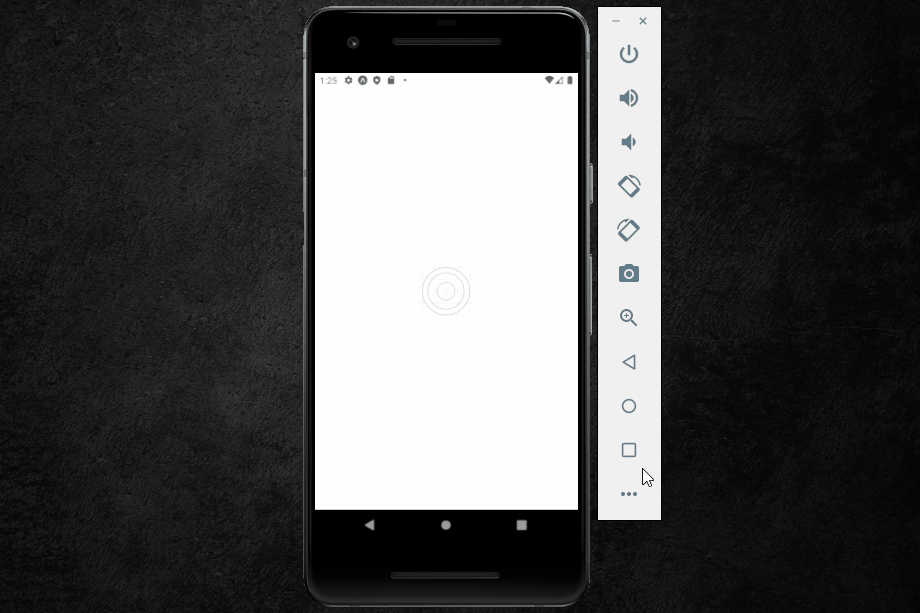

# WorkShop - Sujeito Programador | 

## Seja Bem-vindo(a) !!

Obrigado por visitar meu perfil! :0 
 
 

##  🚀 Detalhes do workshop  🚀

Este workshop foi criado pelo Mateus Fraga (Sujeito Programador) com duração de 4 dias e nele desenvolvemos um aplicativo utilizando <b> react native </b>. 

O projeto consiste em um aplicativo de receitas com um sistema de busca e de favoritamento possuindo um armazenamento interno para que o usuário tenha acesso às informações sem a necessidade de uma conexão a internet, onde também fizemos algumas manipulações de requisições HTTP e utilizamos uma API fake com o JSON-Server para fazermos o armazenamento e implementação de todas as informações das receitas, como: 

<ul>
  <li>Nome ;</li>
  <li>ingredientes ;</li>
  <li>numero de ingredientes ;</li>
  <li>tempo de preparo ;</li>
  <li>ilustração ;</li>
  <li>Video .</li>
</ul>

 Na aba de detalhes, acionada quando clicamos em uma receita, é possível visualizarmos todos os ingredientes e suas quantidades seguidos de um modo de preparo, penso ainda mais no usuário, criamos um modal de video para que o usuário consiga tirar suas dúvidas  ou até mesmo seguir a receita pelo video, sem a necessidade de sair do aplicativo. Na parte superior ha também a opção de favoritar ou desfavoritar uma receita, que mais tarde pode ser acessada com facilidade no menu de navegação. 

  

  

 

## Habilidades utilizadas 💻👨🏻‍💻🖥

 
  <ul >
    <li> HTML  </li>
   <li> CSS &nbsp;&nbsp;  </li>
   <li> React Native &nbsp;&nbsp;  </li>
    </ul>

 

## Considerações finais

Este projeto me possibilitou aprender novos formas de se criar e pensar e também me possibilitou reforçar conhecimentos já adquiridos. Na área de desenvolvimentos existem várias formas de alcançarmos um mesmo objetivo, não ha muito "certo ou errado", na verdade, o que existem são perspectivas, experiencias e vivências diferentes, a área de desenvolvimento nos exige estarmos em constante aprendizado. Para mim, este workshop assim como outros cursos que venho fazendo, foi e é enriquecedor, como dizem os mais sábios:

 <i><b>" A única coisa que ninguém tira de você é o conhecimento"</b</i>.

